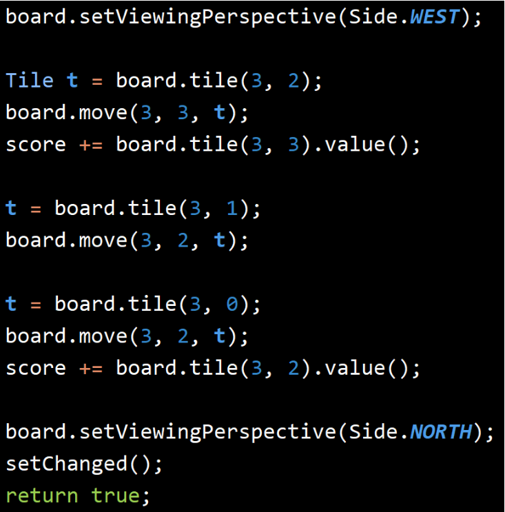

# Game2048
**Computer science is essentially about one thing: Managing complexity.** 
## Task2
When I was working this part, I just replicated the first 
without thinking a lot. But when I ran the test code, there 
were Exceptions which is `NULLPOINTEREXCEPTION`. Because I 
did not check whether the `tile` method return null. Actually,this
method will return null when there are no tiles.

While engaging the development of this part, I must confess that I 
**approached** it **rather hastily**, replicating the code from last task 
without giving it due consideration. Consequently, upon **executing** 
the test code, I encountered an Exception, namely 'NULL..'. I had 
overlooked a crucial aspect ,neglecting to check whether the tile method
returns null pointer. It should be noted that the this method returns null
when no tile is present.

## Task4
There are too many cases needed to consider to pass the tests. When I was 
working on this task, I use the test to help me debug. I wrote a lot of 
codes to handle corner cases, making my code not be elegant.
Fully consider all the cases!
NULLPointerException!

In the case there are nested loops, create a function to alleviate the 
complexity. 